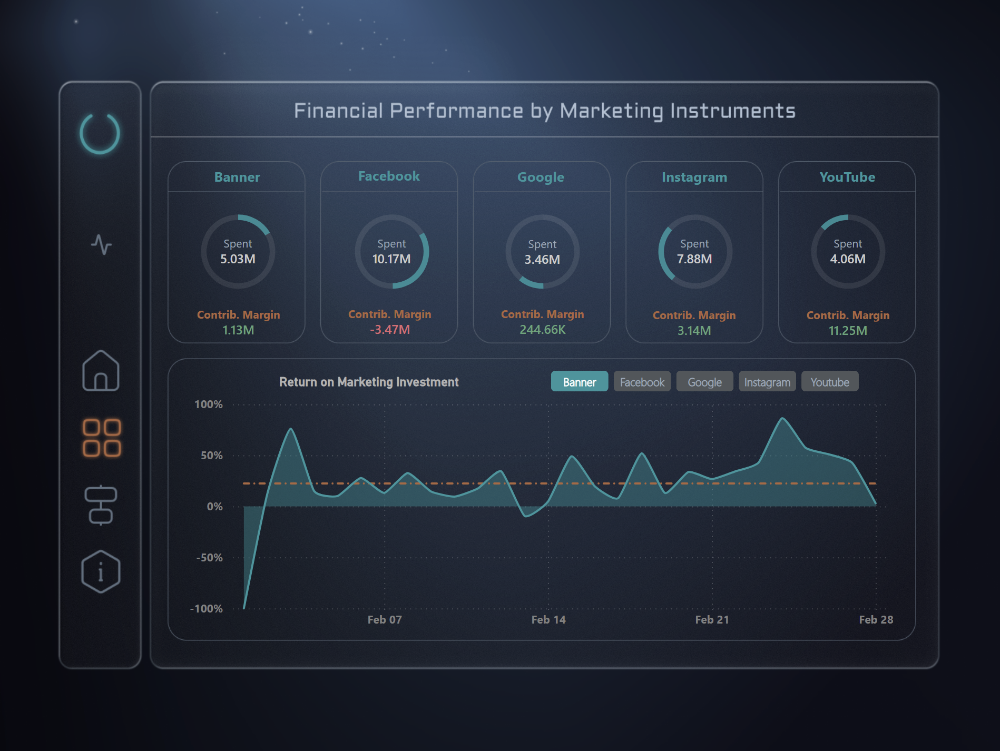
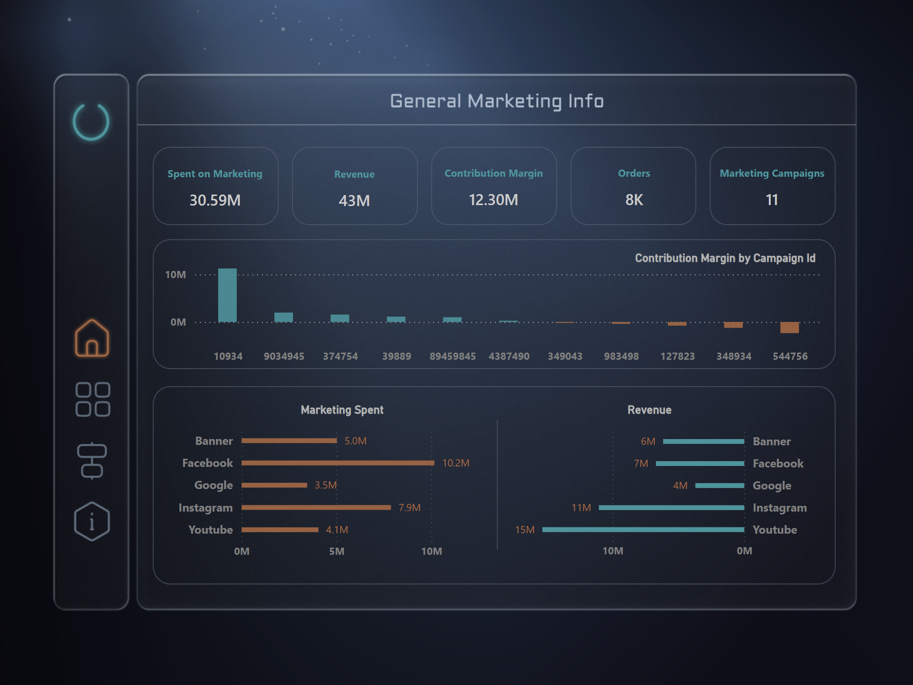

# ONLINE MARKETING CAMPAIGN DASHBOARD IN POWER BI

This repository contains the **ONLINE MARKETING CAMPAIGN DASHBOARD** created in Power BI. It provides detailed insights into online campaigns across various social platforms over a one-month period. The dashboard includes key marketing metrics such as Return on Marketing Investment (ROMI), Contribution Margin, Click-Through Rate (CTR), Lead Rate, Order Rate, Conversion Rate, and more.

The project demonstrates Power BI’s capabilities for creating interactive, app-like dashboards with modern visual design.

[OPEN DASHBOARD ON MICROSOFT SERVICES](https://app.powerbi.com/view?r=eyJrIjoiYmMyNzYyYWEtODM3Yi00MjE5LWIyNmQtZmM3OWFkYWFiNWFkIiwidCI6IjU5YTZhM2Y5LTMwYWItNDBmZi1hNDZhLWYzZThkZDU4OGZhOSIsImMiOjl9)

---

## Table of Contents
1. [Project Overview](#project-overview)
2. [Objectives](#objectives)
3. [Dataset](#dataset)
4. [App Structure](#app-structure)
5. [App Interface](#app-interface)
6. [Requirements](#requirements)
7. [Contributing](#contributing)
8. [License](#license)
9. [Credits and Acknowledgements](#credits-and-acknowledgements)
10. [Author](#author)

---

## Project Overview

### Tools Used
- **Power BI** – for building the dashboard  
- **Figma** – for prototyping and visualization  

**Key Components:**
- Dataset: `Marketing.csv`
- Power BI file: `MarketingProject.pbix`

---

## Objectives

The project aims to answer questions such as:

- What is the overall Marketing Spend and Revenue?  
- Which Marketing Campaigns performed best and worst?  
- What is the sum of marketing expenses by instrument?  
- Which Digital Instruments (Social Media Platforms) provide the best Return on Marketing Investment?  
- Which instrument has the lowest cost per order?  
- What are the conversion rates?  
- How many orders are generated by each instrument?

---

## Dataset

**Size:** 308 rows  

| Column          | Description                                             |
|-----------------|---------------------------------------------------------|
| id              | Unique identifier for each record                       |
| c_date          | Date of the campaign data                                |
| campaign_name   | Name of the marketing campaign                           |
| category        | Category or type of the campaign                         |
| campaign_id     | Unique identifier for the campaign                       |
| impressions     | Number of times the campaign was displayed               |
| mark_spent      | Amount of money spent on the campaign                    |
| clicks          | Number of clicks generated by the campaign               |
| leads           | Number of leads captured from the campaign               |
| orders          | Number of orders resulting from the campaign             |
| revenue         | Total revenue generated from the campaign                |

---

## App Structure

1. **GENERAL MARKETING INFO** – Information about marketing expenses, revenue, and contribution margin by instrument.  
2. **FINANCIAL PERFORMANCE BY MARKETING INSTRUMENT** – Return on Marketing Investment, impressions, clicks, leads, orders by instrument.  
3. **ACQUISITION FUNNEL BY MARKETING INSTRUMENT** – Orders, Click-Through Rate, Lead Rate, Order Rate, Conversion Rate, Cost per Order.  
4. **CONCLUSION NOTES** – Draft insights derived from the analysis.

---

## App Interface

  

---

## Requirements

To open and use the app:

1. Install **Power BI Desktop** (version 2.149.1429.0 recommended) from the [official website](https://www.microsoft.com/en-us/download/details.aspx?id=58494).  
2. Open the file: `MarketingProject.pbix`  
3. To update the dataset, reconnect the `.csv` files from the Dataset folder using **Power Query**.

---

## Contributing

Please follow standard best practices:

- Fork the repository  
- Create a feature branch  
- Commit with clear messages  
- Open a Pull Request

For regular contributions, consider adding:

- `CONTRIBUTING.md`  
- `CODE_OF_CONDUCT.md`

---

## License

This project is licensed under the **MIT License**.  
[View License](https://opensource.org/licenses/MIT)

---

## Credits and Acknowledgements

The content of this project reflects learning gained from **DAN.IT school** walkthrough projects.  

Development issues were resolved using official documentation, community forums, and online resources, including YouTube tutorials.

---

## Author

**Volodymyr Babunych**  
📧 [vbabunych@gmail.com](mailto:vbabunych@gmail.com)  
📍 United Kingdom  
🗓️ December 18, 2025
